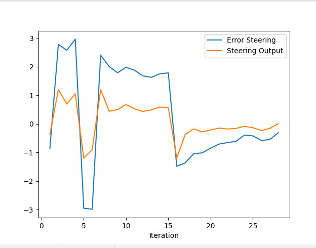
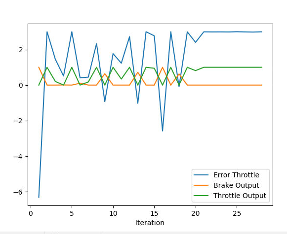

### Question 1: Add the plots to your report and explain them (describe what you see)  
  - The following figure shows the steering error and steering output. The error becomes extremely large after trying to avoiding an obstacle in front of it and had to change its path.  The car was not able to control the steering and as consequence it impossible to drive smoothly..  
  

  - The following figure show continuous osciallation in error throttle which will not provide smooth experience requires further adjust parameters.   
 

### Question 2: What is the effect of the PID according to the plots, how each part of the PID affects the control command? 
**PID** (proportional-integral-derivative) is a widely used control algorithm in engineering and industrial applications. It is a closed-loop control system that uses feedback from a sensor to adjust an actuator (e.g., a motor, wheels) in order to achieve a desired output.

The **PID controller** consists of three components: the *proportional* (P) term, the *integral* (I) term, and the *derivative* (D) term. Each of these components affects the control command in a different way.

- The *proportional* term is directly proportional to the error between the desired setpoint and the actual output. It adjusts the control command in proportion to the error, which means that the larger the error, the larger the correction applied. The *P*-term is mainly responsible for the initial response of the system and helps to reduce the steady-state error. As a result, the P-term provides fast response and reduces overshoot, but it may also cause oscillations and instability.

- The *integral* term integrates the error over time and accumulates a correction that is proportional to the integral of the error. The *I*-term helps to reduce steady-state errors and corrects for biases in the system. The I-term provides a corrective action that increases with time and is proportional to the accumulated error. The I-term can help to reduce oscillations and can make the system more stable, but it may also cause a slow response and overshoot.

- The *derivative* term takes the rate of change of the error into account and applies a correction proportional to the rate of change. The *D*-term helps to reduce overshoot and improve stability. It provides a damping effect that reduces oscillations and prevents the system from overshooting the setpoint. However, it can also make the system more sensitive to noise and disturbances.

### Question 3: How would you design a way to automatically tune the PID parameters?
In order to optimize a set of parameters covered in the PID control Parameter Optimization lesson, the twiddle algorithm can be implemented. By providing initial values for the PID parameters and defining intervals, the PID controller can be executed to analyze the control output. The parameters can then be adjusted up and down based on the outcome, and the new quality marker can be calculated to determine whether to replace the parameters only if the result is improved.

### Question 4: PID controller is a model free controller, i.e. it does not use a model of the car. Could you explain the pros and cons of this type of controller?
There are several advantages and disadvantages to using a model-free controller like the PID controller:

- Advantages:

    - Simplicity: PID controllers are relatively simple to implement and require minimal information about the system being controlled. This can be advantageous in situations where a model of the system is not available or is too complex to use in a control system.

    - Robustness: Because PID controllers do not rely on a model of the system, they are generally more robust and can handle changes in the system more easily. This makes them useful in situations where the system being controlled is subject to varying conditions or uncertainties.

    - Fast response: The PID controller can provide a fast response to changes in the system output, which is important in applications where the system needs to be controlled in real-time.

- Disadvantages:

  - Lack of accuracy: PID controllers can be less accurate than model-based controllers in some situations, particularly when the system being controlled is highly nonlinear or has significant uncertainties.

  - Tuning complexity: Tuning a PID controller can be complex, and it may require extensive trial and error to find the appropriate values for the controller gains.

  - Limited control: The PID controller has limited control capabilities and may not be suitable for systems that require more advanced control techniques.
